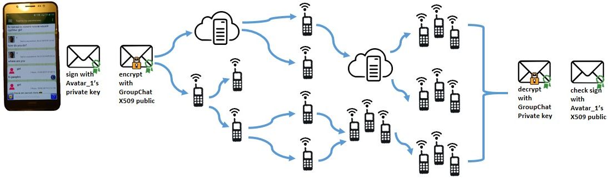
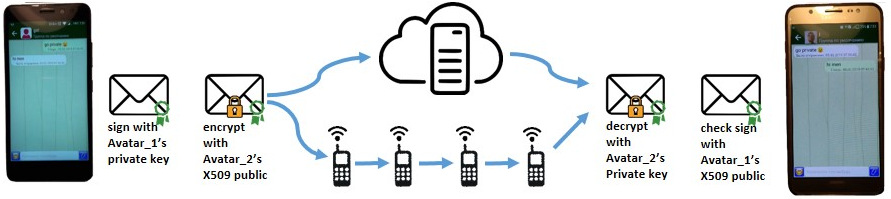

# The official repository of the software complex "SpecNet".

SpecNet allows you to organize the exchange of messages between people in a difficult situation when traditional communication systems can not be used:
* after natural disasters (tsunami, earthquake, tornado, etc.)
* far from human civilization (taiga, desert, ocean, etc.)
* in case of blocking communication by dictatorial regime or terrorists

Currently, software complex "SpecNet" consists of:
1. Android application that allows you to transfer messages from phone to phone:
* via Wi-Fi (works for API 19 versions - till API 24)
* via the TCP/IP connection of the Internet / Wi-Fi network (works starting from API 19).
2. SpecNet server for organizing a TCP/IP communication channel via the Internet or Wi-Fi network (implemented in C ++, tested under Linux. It is planned to complete the implementation for other common operating systems and to run directly on Wi-Fi equipment).

As you develop for other devices and media, the source code will be uploaded to this repository.

#### Work schemes:

All communication takes place within groups and is encrypted with the X509 / Private key RSA 1024 (256 bit AES) crypto pair. By default, everyone can connect to the Default group and chat (because Default crypto pair hardcoded into SpecNet):

When connecting to a group, each person auto creates his own Avatar, which receives a personalized cryptopair X509 / Private key - this allows you to send private messages that only the addressee can read (private chat):

Messages are transmitted via a SpecNet server or from phone to phone. If you do not want other people's messages to be transmitted via your phone, then you can create your own group, and leave the Default group - only members of the group participate in the transfers, only the messages of their group are transmitted. So the SpecNet server is also configured by uploading X509 group certificates == which groups can transmit messages. Transit messages are transmitted as black boxes and the recipient appears only as a combination of int_64t[2] numbers: group identifier and Avatar identifier (for the group chat Avatar identifier == 0LL).

## FAQ
1. Will not messages be infinitely transmitted with increasing their number?
- Each message has a counter of available hops (by default 5) - each time you move from phone to phone, the counter decreases. When the counter is reduced to 0 - the transfer can occur only if the addressee directly connected to the phone (by group ID and avatar ID).

2. Will other people's messages take up much space on the phone?
- The settings indicate the free space that is guaranteed to remain on the phone, as well as the lifetime of private messages and group chat messages. The regular purge task will check that the messages are deleted. In addition, you can specify in the settings that the encrypted messages must be stored on the SD card.
- When you works with SpecNetServer, only messages intended for you and for the chat group will be downloaded to the phone.

3. Where are the decrypted messages stored?
- Decrypted messages are stored in the private cache of the Android application and can be deleted when you exit the application (specified in the Security settings)

4. Will battery power be heavily drained?
- in the Internet mode, communication with the SpecNetServ server occurs according to the interval specified in the settings or when sending a message when the button is pressed. This is less than other instant messengers = drain less.
- in the Wi-Fi client mode, the consumption depends on how often devices with SpecNet Wi-Fi server are found and message excahnge occurs. The charge consumption is average.
- in the Wi-Fi server mode, it is better to connect the phone to an external additional rechargeable battery.
- in the Off mode after exiting the graphical shell, the SpecNet is completely disabled and does not consume anything. Android reboot events, connection to a charger and other not monitored - the application can be used only when it is needed, and the rest of the time it is just an icon.

5. Can the application be blocked by the dictatorship or terrorists?
- in the settings you can specify a specific IP address and port where the SpecNet server is located = No DNS issues
- in the settings you can specify the Web site, where in any comments will be specified the IP address and port of the server SepcNetServ. So you can specify multiple servers and messages will go through available servers.
- SpecNetServ server can be run anywhere, for example, directly on the network equipment of the service provider or home Wi-Fi router (if mobility is needed, the Wi-Fi router can be carried with you in the backpack). The server does not respond until a properly encrypted request arrives, and the answers are also encrypted with the public key of the group - it will be difficult to find by port scans.
- The application itself exists in the form of an installer APK or you can build it yourself from the sources.

6. It is difficult .. Was it impossible to make it easier than other messengers?
- When you start SpecNet for the first time, messages from the training wizard begin to arrive - there are just a few steps to learn how to configure application and even create your own groups. In fact, it is much easier than the average computer game.

7. How to send a private message?
- you need to get at least some message in the group chat from the Avatar to whom you want to write privately - as soon as the SpecNet sees an unfamiliar avatar ID, it requests the avatar's X509 certificate. So along with the messages is distributed PKI. Now you can click on the Avatar icon in your address book or in the group chat feed and go to private chat.

---
## Additional Information

Any SpecNet application can add itself to the default group, so there may be collisions with avatar names and IDs. Therefore, consider the default group as a means of communication for a critical event when there is no time to organize your own group. The creator of a personal group controls the membership and uniqueness of avatar names / identifiers. Groups on each device can be a lot for each task. You can be the creator of some groups and enter as an ordinary member in others - this allows you to create an organization with a hierarchy of independent groups (like fullerenes that are stronger than diamonds).

SpecNetServ is only a transmission medium, there can be many servers, anywhere. When a site is specified in the SpecNet settings where to find the IP and port of the server, all the addresses found by tags will be added to the array and used to communicate in the specified order. Those. server loss is not critical, replication is not needed. The message will be delivered in any available way.
If dictatorship or terrorists captures the server, then only encrypted files and a database with int64_t numbers will be detected on it.

---
## Build/Install
#### How to build a SpecNetServ server from source code:
Here will be a link to WiKi..
Here will be a link to compiled binary..

#### How to build a SpecNet Android app from source code:
A link to WiKi will be posted here after I find time to modify the code according to the Google C ++ Style Guide and Google Java Style Guide.

[Android application](https://play.google.com/store/apps/details?id=com.bond.specnet)
---
  Copyright (c) Dmitriy Bondarenko
  feel free to contact me: specnet.messenger@gmail.com

